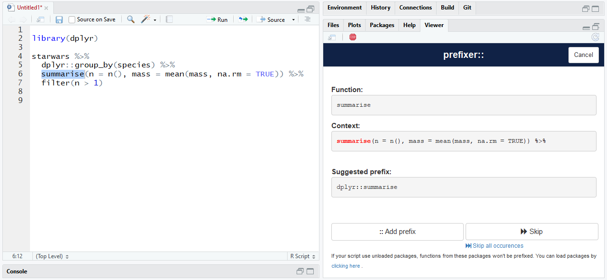

# prefixer::

> Prefix function with their namespace

[](https://travis-ci.org/dreamRs/prefixer)
[](http://www.repostatus.org/#active)


## Overview

It can be useful to prefix function in a script to prevent use of the wrong one, e.g. `stats::filter` vs `dplyr::filter` or `plyr::summarise` vs `dplyr::summarise`.
This package provide a Shiny gadget to interactively add prefix to function in a script, if a function exist in several packages, you can choose the one you want use.

If you're in a package, you can generate `@importFrom` tag from function definition and after remove prefix if needeed.


Installation :

```r
# From Github only for now
source("https://install-github.me/dreamRs/prefixer")

# or traditionnal :
devtools::install_github("dreamRs/prefixer")
```


## prefixer:: gadget

You can launch the addin via RStudio's Addins menu. Interface looks like this :




```r
fread_dir <- function(path, pattern = "\\.csv$") {
  paths <- list.files(path = path, pattern = pattern, full.names = TRUE)
  files <- lapply(paths, fread)
  files <- setNames(files, paths)
  rbindlist(l = files, idcol = "path")
}
```

Becomes => 

```r
fread_dir <- function(path, pattern = "\\.csv$") {
  paths <- list.files(path = path, pattern = pattern, full.names = TRUE)
  files <- lapply(paths, data.table::fread)
  files <- stats::setNames(files, paths)
  data.table::rbindlist(l = files, idcol = "path")
}
```


## @importFrom

From prefixed functions, you can generate roxygen `@importFrom` tag via addin *@importFrom*.

Or manually with `import_from(fun = fread_dir)`:

```r
#' @importFrom data.table fread rbindlist
#' @importFrom stats setNames
fread_dir <- function(path, pattern = "\\.csv$") {
  paths <- list.files(path = path, pattern = pattern, full.names = TRUE)
  files <- lapply(paths, data.table::fread)
  files <- stats::setNames(files, paths)
  data.table::rbindlist(l = files, idcol = "path")
}
```


## Unprefix

After generated `@importFrom` tags, you can if you want remove prefix before your functions via addin *Unprefix* : 

```r
#' @importFrom data.table fread rbindlist
#' @importFrom stats setNames
fread_dir <- function(path, pattern = "\\.csv$") {
  paths <- list.files(path = path, pattern = pattern, full.names = TRUE)
  files <- lapply(paths, fread)
  files <- setNames(files, paths)
  rbindlist(l = files, idcol = "path")
}
```


## Roxygen comments

Addin `Roxygen comment` allow to put comment selected line with `#'`.


